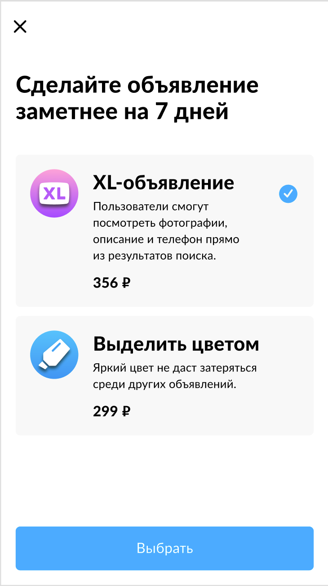

# Avito-tech 2020 internship test task

[Original task descripton](https://github.com/avito-tech/internship)

## Task
- Implement screen according to [reference example](https://raw.githubusercontent.com/khabibullet/avito-test-2020/master/readme/screen.png). Choose indentation and fonts approximately.
- Source data should be parsed from [JSON](https://raw.githubusercontent.com/khabibullet/avito-test-2020/master/readme/result.json)

## UI interaction logics
- Elements on the gray background and "select" button are tapable, but cross sign is not.
- Element is marked by checkmark if tapped or unchecked if it is already marked.
- Only one element can be marked simultaneously.
- The allert with choosen service is shown if "select" button is tapped.

## Not recommended
- Using SwiftUI
- Using external dependencies
  
## Recommended
+ Not using Storyboard
+ Using UICollectionView
+ VIPER
 

# Implementation
 

| Implementation |Reference |
|:--:|:--:|
|  | |
 

## Features
- UICollectionView
- MVC
- Network service dependency injection
- Checkmarks state observation
- Alert in case of network errors
- iOS 12+ support

